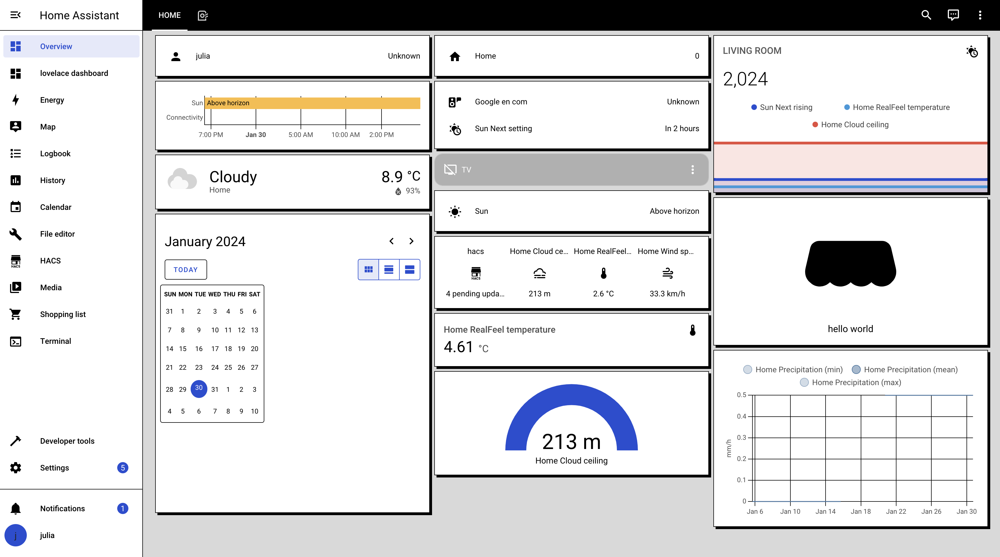
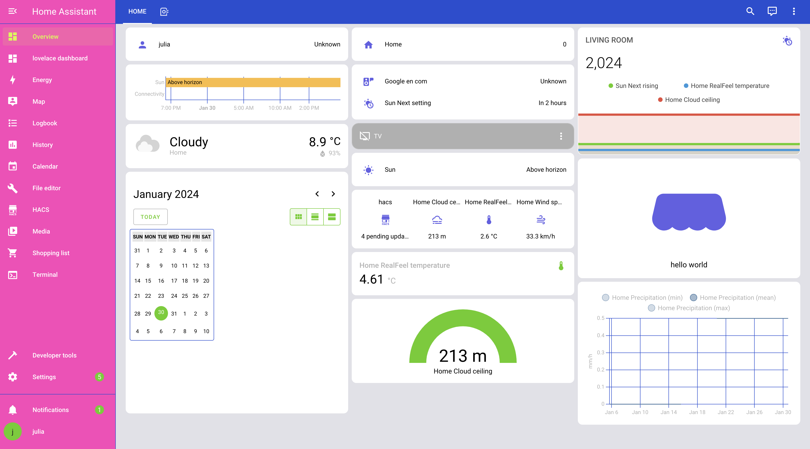

# Home Assistant themes
Home Assistant themes created by Robonomics team.

### Manual
1. Add the following code to your `configuration.yaml` file (reboot required).

```yaml
frontend:
  ... # your configuration.
  themes: !include_dir_merge_named themes
  ... # your configuration.
```
2. Clone the repository
```bash
git clone https://github.com/airalab/home-assistant-themes.git
```

3. Copy `themes/theme_name.yaml` in your existing (or create it) `themes/` folder.

```bash
mv home-assistant-themes/themes/theme_name.yaml <PATH_TO_YOUR_HOME_ASSISTANT_FOLDER>/themes/.
```

### Backgrounds

There are also backgrounds for some themes in the `backgrounds` folder. In order to use them you need to have [hacs](https://hacs.xyz/) installed.

Copy the folder to your Home Assistant folder for the backgrounds to appear in your dashboard.


### Themes previews

1. Robonomics 


2. Black and White



3. Neon



3. Dark


