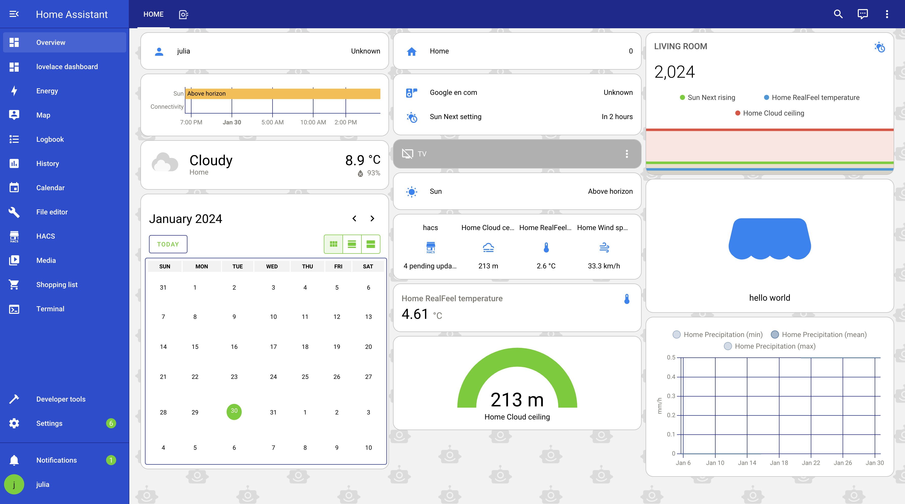
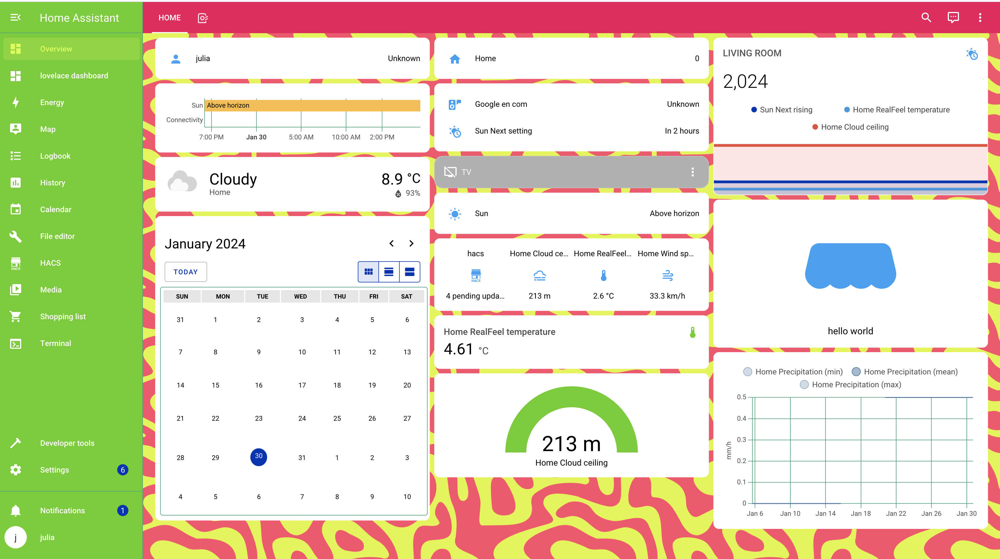
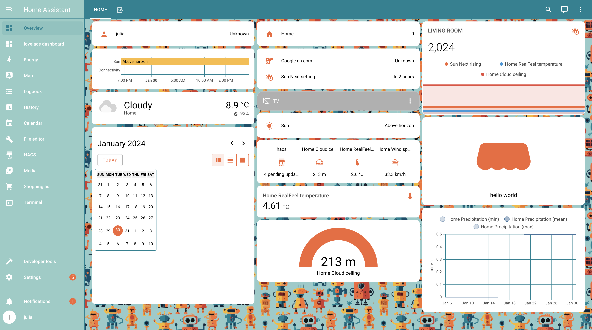

# Home Assistant themes
Home Assistant themes created by Robonomics team.

## Install

### Using HACS

1. Navigate to the HACS panel and click on the three dots located in the upper right corner. Then, select `Custom repositories`.

2. Paste the provided link into the `Repository` field, select `Theme` from the `Category` dropdown menu, and click the `ADD` button.
```
https://github.com/airalab/home-assistant-themes.git
```
3. Next, search for `robonomics Theme` in the HACS search bar. Once found, select it and hit the `Download` button.


### Manual
> Note: If you are using Home Assistant OS to get access to your configuration file use "File Editor" or "SSH" ADD-ONs.
> How to install "File Editor" find at the bottom of README.

1. Add the following line to your `configuration.yaml` file if it isn't added (reboot required).

```yaml
  frontend:
  ... # your configuration.
    themes: !include_dir_merge_named themes
  ... # your configuration.
```


2. Clone the repository
```bash
git clone https://github.com/airalab/home-assistant-themes.git
```

3. Copy `themes/<THEME_NAME>.yaml` in your existing (or create it) `themes/` folder.

```bash
cp home-assistant-themes/themes/<THEME_NAME>.yaml <PATH_TO_YOUR_HOME_ASSISTANT_FOLDER>/themes/.
```

To copy all themes use next:

```shell
cp home-assistant-themes/themes/* <PATH_TO_YOUR_HOME_ASSISTANT_FOLDER>/themes/.
```

## Backgrounds

There are also backgrounds for some themes in the `backgrounds` folder. To install them, first you have to create `www` folder in your homeassistant 
configuration directory. And create `backgrounds` folder in it:

```shell
mkdir -p <PATH_TO_YOUR_HOME_ASSISTANT_FOLDER>/www/backgrounds
```

Copy the folder with backgrounds to your Home Assistant `www` folder for the backgrounds to appear in your dashboard.

```bash
mv home-assistant-themes/backgrounds/* <PATH_TO_YOUR_HOME_ASSISTANT_FOLDER>/www/backgrounds/
```

## Use Theme
Finally, you can choose theme in `profile` in `theme` section. More [here](https://www.home-assistant.io/integrations/frontend/#manual-theme-selection).


### File Editor ADD-ON Installation

If you do not have file editor in your sidebar: 

1. Go to `profile` and switch on *Advanced mode*

2. Then, go to `settings` -> `add-ons`. Click on `ADD-ON STORE` button and search for **file editor**.

3. Install it. Once the file editor installed click `start` button. The switch on `Show in sidebar` option.

4. This is it! Now you can edit your files.


### Themes previews

1. Robonomics 



2. Black and White


3. Neon


4. Dark


5. Neon Green



6. AI


