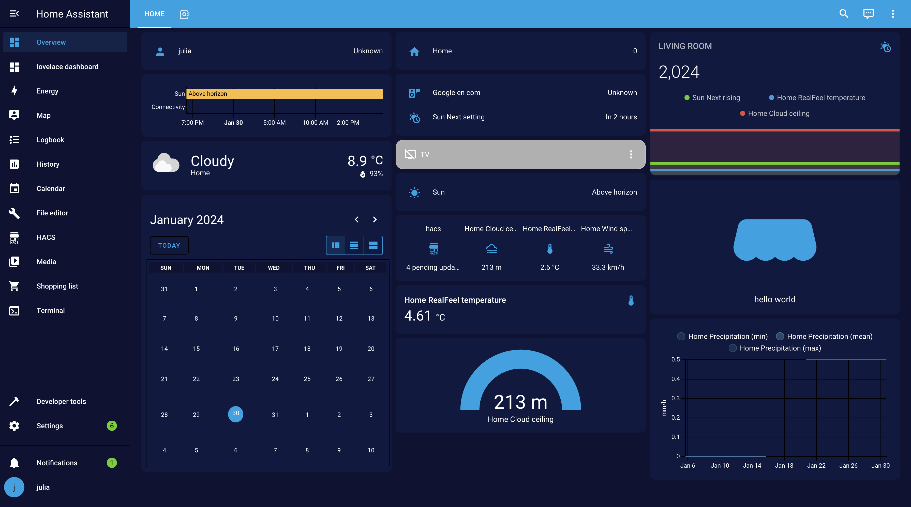

# Home Assistant themes
Home Assistant themes created by Robonomics team.

### Manual
1. Add the following code to your `configuration.yaml` file (reboot required).

```yaml
frontend:
  ... # your configuration.
  themes: !include_dir_merge_named themes
  ... # your configuration.
```
2. Clone the repository
```bash
git clone https://github.com/airalab/home-assistant-themes.git
```

3. Copy `themes/theme_name.yaml` in your existing (or create it) `themes/` folder.

```bash
mv home-assistant-themes/themes/theme_name.yaml <PATH_TO_YOUR_HOME_ASSISTANT_FOLDER>/themes/.
```

> Note: If you are using Home Assistant Supervised (e.g for macos) you need to add theme to /themes/ in file editor add-on. 


### Backgrounds

There are also backgrounds for some themes in the `backgrounds` folder. In order to use them you need to have [hacs](https://hacs.xyz/) installed.

Copy the folder to your Home Assistant folder for the backgrounds to appear in your dashboard.

```bash
mv home-assistant-themes/backgrounds/ <PATH_TO_YOUR_HOME_ASSISTANT_FOLDER>home-assistant-themes/backgrounds/.
```

> Note: If you are using Home Assistant Supervised (e.g for macos) you need to add background folder to www/community/ in file editor add-on.
> Then, you need to manually change path to the image in theme_name.yaml file - e.g. "/hacsfiles/backgrounds/robonomicstheme_pattern.svg"

### Use Theme
Finally, you can choose theme in `profile` in `theme` section. More [here](https://www.home-assistant.io/integrations/frontend/#manual-theme-selection)


### File Editor ADD-ON

If you do not have file editor in your sidebar: 

1. Go to `profile` and switch on *Advanced mode*

2. Then, go to `settings` -> `add-ons`. Click on `ADD-ON STORE` button and search for **file editor**.

3. Install it. Once the file editor installed click `start` button. The switch on `Show in sidebar` option.

4. This is it! Now you can edit your files.


### Themes previews

1. Robonomics 


2. Black and White


3. Neon


4. Dark


